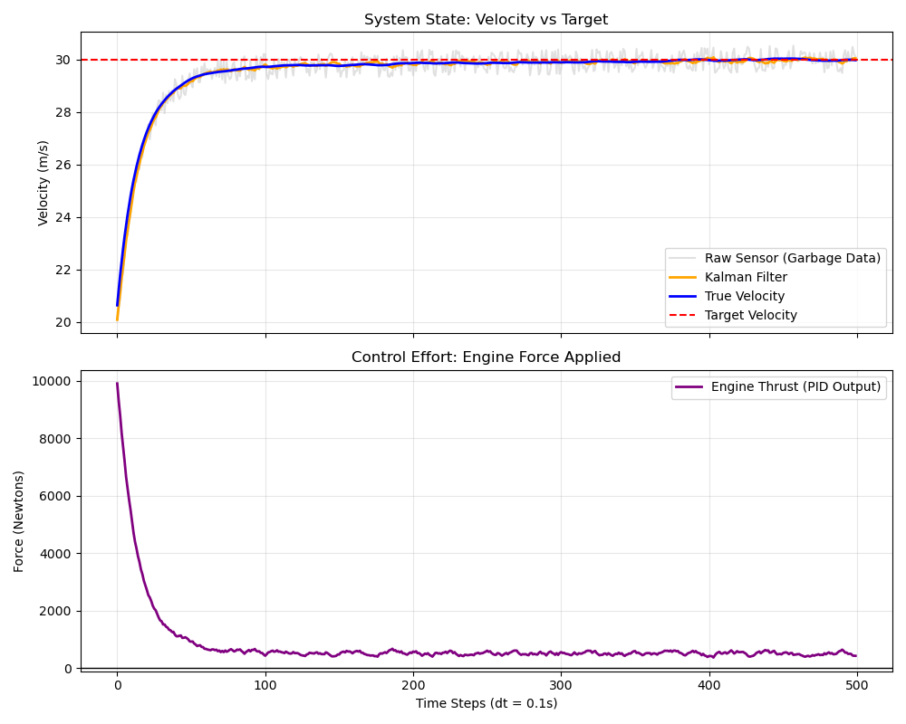

# Cruise-Control-Simulation
## Overview
Simulation of cruise control for a car modelled with python automated using PID. A Kalman filter and EMA low-pass filter were used to filter artificial sensor noise.
## Features:
* **Simulated Car Physics:** Modelled non-linear forces using Euler method to simulate car motion over a time period.
* **Noisy Data:** Synthetic sensor noise was added to velocity and location measurements before they were used in PID calculations to emulate real-life measurement error.
* **PID Control:** PID controller was used to control thrust force based on motion of the car as it approached its target cruise-control velocity. Anti-windup integration and an EMA low-pass filtered derivative were used to reduce overshoot and high frequency engine vibration respectively.
* **Kalman Filter:** A Kalman Filter was implemented using Numpy to estimate true velocity from noisy velocity and location measurements.

## Visual Output



Response curve of top graph indicates a system where the simulated car approaches the target velocity smoothly without overshoot or jerk. Vibrations in thrust force are minimised as shown in bottom graph.

## Usage
```bash
pip install -r requirements.txt
python simulation.py
